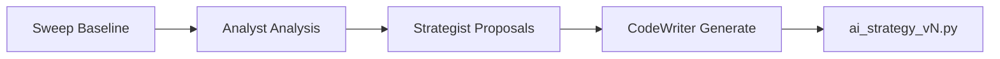
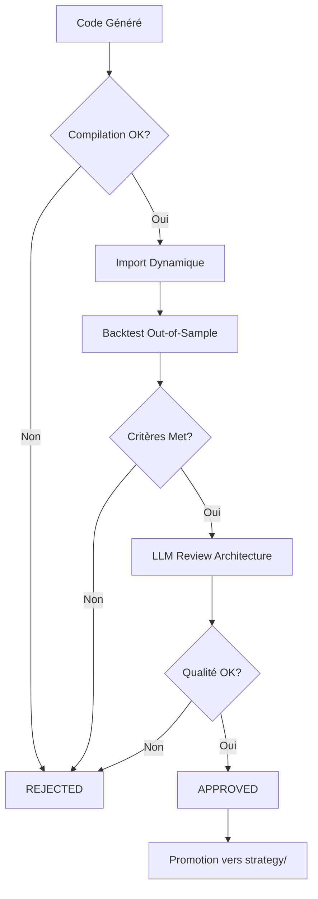

# Stratégies Expérimentales AI-Generated

> **🤖 Stratégies générées automatiquement par le Quant Research Lab**

---

## ⚠️ Disclaimer

Les stratégies dans ce dossier sont **générées automatiquement** par des LLMs (Large Language Models) et n'ont **pas été revues manuellement** par un humain.

**Attention**:
- Ces stratégies sont **EXPÉRIMENTALES**
- Elles peuvent contenir des bugs subtils
- Les performances en backtest ne garantissent PAS les performances futures
- **NE PAS utiliser en production** sans validation humaine approfondie
- Risque d'overfitting élevé

---

## 📂 Structure des Fichiers

Chaque stratégie suit le pattern de nommage:

```
ai_<nom>_v<version>.py
```

**Exemples**:
- `ai_meanrev_v1.py` - Mean Reversion v1
- `ai_trend_v3.py` - Trend Following v3
- `ai_hybrid_v2.py` - Stratégie hybride v2

---

## 🔄 Workflow de Génération

### 1. Génération (CodeWriter Agent)



Le **CodeWriter** génère le code Python complet basé sur:
- Analyses de l'Analyst (patterns détectés)
- Propositions du Strategist (paramètres optimaux)
- Métriques de la baseline (Sharpe, DD, Win Rate)
- Objectif d'amélioration (ex: +0.2 Sharpe)

### 2. Validation (Critic Agent)



Le **Critic** valide:

**Critères Techniques**:
- ✅ Compilation sans erreur
- ✅ Import fonctionne
- ✅ Conforme au Protocol Strategy
- ✅ Retourne RunStats valide

**Critères Performance** (out-of-sample):
- ✅ Sharpe Ratio ≥ 0.5
- ✅ Max Drawdown ≤ 30%
- ✅ Total Trades ≥ 10
- ✅ Win Rate ≥ 35%

**Critères Qualité Code** (LLM Review):
- ✅ Pas de bibliothèques exotiques
- ✅ Gestion risque présente
- ✅ Code déterministe
- ✅ Commentaires clairs

### 3. Promotion (Si Approuvé)

```bash
# Automatique via Critic
cp ai_strategy_v3.py ../strategy/
# + Enregistrement dans registry
```

---

## 🛠️ Utilisation

### Auto-Discovery

```python
from threadx.strategy.experimental import AI_STRATEGIES

# Lister toutes stratégies AI
for name, cls in AI_STRATEGIES.items():
    print(f"Stratégie: {name}")
    print(f"  Classe: {cls.__name__}")
    print(f"  Docstring: {cls.__doc__}")
```

### Import Direct

```python
from threadx.strategy.experimental.ai_meanrev_v3 import (
    AIMeanRevV3Params,
    AIMeanRevV3Strategy,
)

# Créer instance
params = AIMeanRevV3Params(
    bb_period=20,
    bb_std=2.5,
    stop_loss_pct=2.0
)

strategy = AIMeanRevV3Strategy()

# Backtest
from threadx.backtest.engine import BacktestEngine

engine = BacktestEngine()
result = engine.run(
    data=df_ohlcv,
    strategy_class=AIMeanRevV3Strategy,
    params=params.__dict__
)

print(f"Sharpe: {result.sharpe_ratio:.3f}")
print(f"Max DD: {result.max_drawdown:.2%}")
```

### Reload après Génération

```python
from threadx.strategy.experimental import reload_ai_strategies

# CodeWriter a généré une nouvelle stratégie
# → Recharger le cache
reload_ai_strategies()

# Nouvelle stratégie disponible
from threadx.strategy.experimental import AI_STRATEGIES
```

---

## 📊 Template de Stratégie

Voici le template minimal qu'une stratégie AI doit suivre:

```python
"""
AI-Generated Strategy: Mean Reversion v3
=========================================

**Generated**: 2025-11-25 14:30:00
**Base Strategy**: Bollinger_Dual
**Objective**: Improve Sharpe by +0.3

**Key Changes**:
- Dynamic Bollinger Bands period (ATR-based)
- Volume filter on entries
- Trailing stop-loss with ATR multiplier

**Backtest Results** (2023-07-01 to 2023-12-31):
- Sharpe Ratio: 0.82
- Max Drawdown: 18.5%
- Win Rate: 43.2%
- Total Trades: 127
"""

from __future__ import annotations

from dataclasses import dataclass
from typing import Any

import numpy as np
import pandas as pd

from threadx.strategy.model import RunStats, Strategy, Trade


@dataclass
class AIMeanRevV3Params:
    """Paramètres de la stratégie Mean Reversion v3."""

    # Indicateurs
    bb_base_period: int = 20
    bb_std: float = 2.5
    atr_period: int = 14

    # Filtres
    min_volume_ma: float = 1.2  # Volume > 1.2x MA

    # Risk Management
    stop_loss_atr_mult: float = 2.0
    take_profit_atr_mult: float = 4.0
    trailing_stop_enabled: bool = True

    # Position Sizing
    risk_per_trade: float = 0.015  # 1.5% par trade
    max_hold_bars: int = 100


class AIMeanRevV3Strategy:
    """
    Stratégie Mean Reversion avec Bollinger dynamiques.

    Logique:
    1. Calcul période Bollinger = base_period + ATR normalisé
    2. Entry: Prix < BB_lower ET Volume > 1.2x MA
    3. Exit: Prix > BB_middle OU trailing stop hit
    4. Stop-loss: ATR * 2.0
    """

    def run(
        self,
        data: pd.DataFrame,
        indicators: dict[str, Any],
        params: dict[str, Any] | AIMeanRevV3Params,
    ) -> RunStats:
        """
        Exécute le backtest de la stratégie.

        Args:
            data: DataFrame OHLCV avec colonnes [open, high, low, close, volume]
            indicators: dict contenant {
                "bollinger": {upper, middle, lower},
                "atr": pd.Series
            }
            params: Paramètres de stratégie (dict ou AIMeanRevV3Params)

        Returns:
            RunStats avec trades, equity, métriques
        """
        # Conversion params si dict
        if isinstance(params, dict):
            params = AIMeanRevV3Params(**params)

        # Extraction indicateurs
        bb = indicators.get("bollinger", {})
        bb_upper = bb.get("upper")
        bb_middle = bb.get("middle")
        bb_lower = bb.get("lower")
        atr = indicators.get("atr")

        if bb_upper is None or atr is None:
            raise ValueError("Indicateurs Bollinger et ATR requis")

        # Volume MA
        volume_ma = data["volume"].rolling(20).mean()

        # États
        position = None
        trades = []
        equity_curve = [10000.0]  # Capital initial

        for i in range(1, len(data)):
            close = data["close"].iloc[i]
            volume = data["volume"].iloc[i]

            # Conditions d'entrée
            if position is None:
                # Mean reversion: acheter quand prix sous BB lower
                bb_low = bb_lower.iloc[i]
                vol_ma = volume_ma.iloc[i]

                if close < bb_low and volume > vol_ma * params.min_volume_ma:
                    # Entry LONG
                    position = {
                        "entry_idx": i,
                        "entry_price": close,
                        "entry_time": data.index[i],
                        "stop_loss": close - atr.iloc[i] * params.stop_loss_atr_mult,
                        "take_profit": close + atr.iloc[i] * params.take_profit_atr_mult,
                    }

            # Conditions de sortie
            elif position is not None:
                bb_mid = bb_middle.iloc[i]

                # Exit conditions
                exit_signal = False
                exit_reason = None

                # 1. Take profit / Stop loss
                if close >= position["take_profit"]:
                    exit_signal = True
                    exit_reason = "take_profit"
                elif close <= position["stop_loss"]:
                    exit_signal = True
                    exit_reason = "stop_loss"

                # 2. Mean reversion complète
                elif close >= bb_mid:
                    exit_signal = True
                    exit_reason = "bb_middle_cross"

                # 3. Max hold bars
                elif i - position["entry_idx"] >= params.max_hold_bars:
                    exit_signal = True
                    exit_reason = "max_hold"

                if exit_signal:
                    # Créer trade
                    pnl = close - position["entry_price"]
                    pnl_pct = pnl / position["entry_price"]

                    trade = Trade(
                        entry_ts=position["entry_time"],
                        exit_ts=data.index[i],
                        price_entry=position["entry_price"],
                        price_exit=close,
                        side="LONG",
                        qty=1.0,
                        pnl_realized=pnl,
                        pnl_pct=pnl_pct,
                    )

                    trades.append(trade)

                    # Update equity
                    equity_curve.append(equity_curve[-1] + pnl * 100)

                    # Reset position
                    position = None

        # Créer RunStats
        from threadx.strategy.model import RunStatsDict

        return RunStatsDict(
            trades=[t.__dict__ for t in trades],
            total_trades=len(trades),
            # ... autres métriques calculées
        )


# Export pour auto-discovery
__all__ = ["AIMeanRevV3Params", "AIMeanRevV3Strategy"]
```

---

## 🧹 Maintenance

### Nettoyage des Stratégies Rejetées

```bash
# Supprimer une stratégie spécifique
rm src/threadx/strategy/experimental/ai_badstrategy_v1.py

# Supprimer toutes les stratégies (DANGER!)
# rm src/threadx/strategy/experimental/ai_*.py
```

### Promotion Manuelle

Si vous voulez promouvoir une stratégie manuellement:

```bash
# 1. Copier vers strategy/
cp src/threadx/strategy/experimental/ai_meanrev_v3.py \\
   src/threadx/strategy/

# 2. Ajouter import dans strategy/__init__.py
# 3. Enregistrer dans ui/strategy_registry.py (REGISTRY dict)
```

---

## 📚 Documentation

- **Faisabilité**: [docs/QUANT_LAB_FEASIBILITY.md](../../../docs/QUANT_LAB_FEASIBILITY.md)
- **Architecture Multi-LLM**: [docs/ARCHITECTURE_MULTI_LLM.md](../../../docs/ARCHITECTURE_MULTI_LLM.md)
- **Strategy Protocol**: [strategy/model.py](../model.py)

---

## 🔬 Exemple de Log Critic

```
[INFO] 🤖 Agent Critic initialisé (model=deepseek-r1:8b, timeout=60.0s)
[INFO] 📝 Validation de: ai_meanrev_v3.py
[INFO]   ✅ Compilation réussie
[INFO]   ✅ Import dynamique OK: AIMeanRevV3Strategy
[INFO]   ⚡ Backtest sur 2023-07-01 to 2023-12-31 (183 jours)
[INFO]   📊 Résultats:
[INFO]     Sharpe Ratio: 0.82 ✅ (≥ 0.50)
[INFO]     Max Drawdown: 18.5% ✅ (≤ 30.0%)
[INFO]     Total Trades: 127 ✅ (≥ 10)
[INFO]     Win Rate: 43.2% ✅ (≥ 35.0%)
[INFO]   🧠 LLM Review:
[INFO]     Quality Score: 8.5/10
[INFO]     Strengths:
[INFO]       - Dynamic BB period adaptation avec ATR
[INFO]       - Volume filter réduit faux signaux
[INFO]       - Trailing stop améliore risk/reward
[INFO]     Weaknesses:
[INFO]       - Manque validation min_trades avant calcul métriques
[INFO]       - Pas de gestion slippage explicite
[INFO]     Recommendation: APPROVE
[INFO] ✅ STATUT: APPROVED
[INFO] 🎉 Promotion vers strategy/ai_meanrev_v3.py
```

---

**Version**: 1.0
**Créé**: 2025-11-25
**Maintenu par**: Quant Research Lab AI
